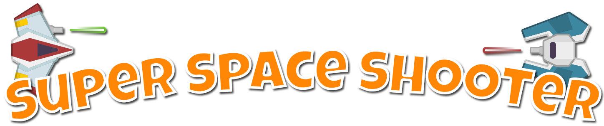
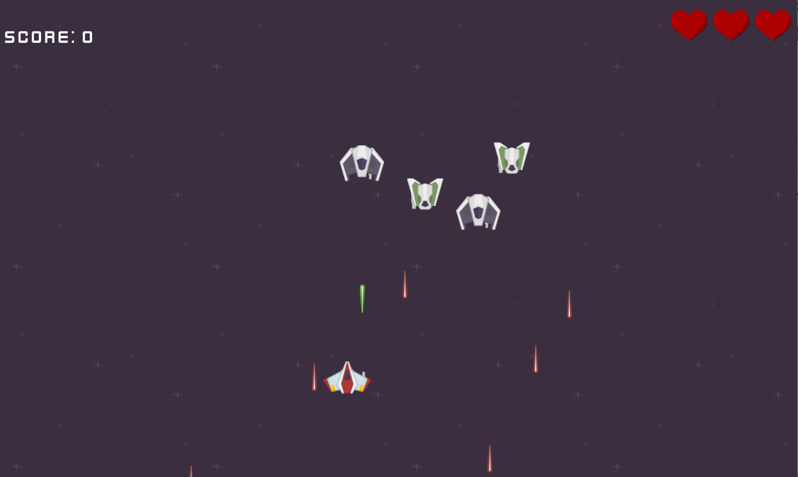

Super Space Shooter is a Unity demo game showing simple mechanics such as audio, animations, AI and UI. The purpose of this project is to give beginner developers a stepping stone into creating their own games.

## Development Challenges
Super Space Shooter is a bare bones game that has many opportunities to be extended and enhanced. I've come up with a set of development [challenges](DevelopmentChallenges.md) to help begin breaking down the design.

## Credit
This project uses the [Luckiest Guy](http://www.1001fonts.com/luckiest-guy-font.html) Font and graphics/sounds provied by Kenney. Assets can be found at http://kenney.nl/. The exact asset packs used are:
* [Space Shooter Redux](http://kenney.nl/assets/space-shooter-redux)
* [Digital Audio](http://kenney.nl/assets/digital-audio)
* [UI Pack](http://kenney.nl/assets/ui-pack)
